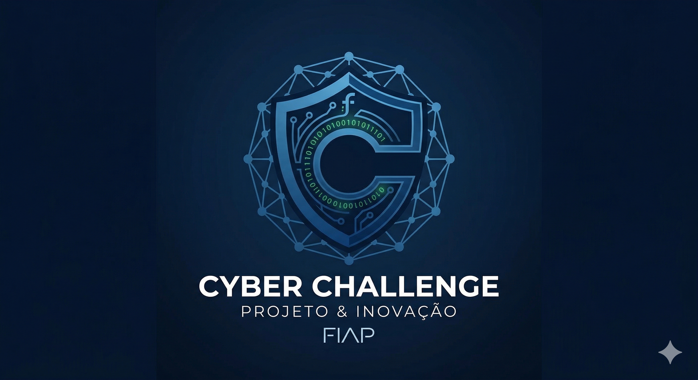
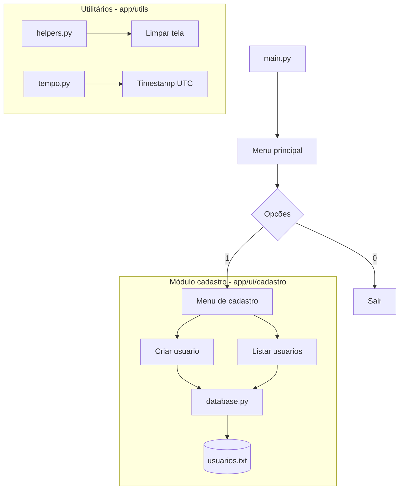
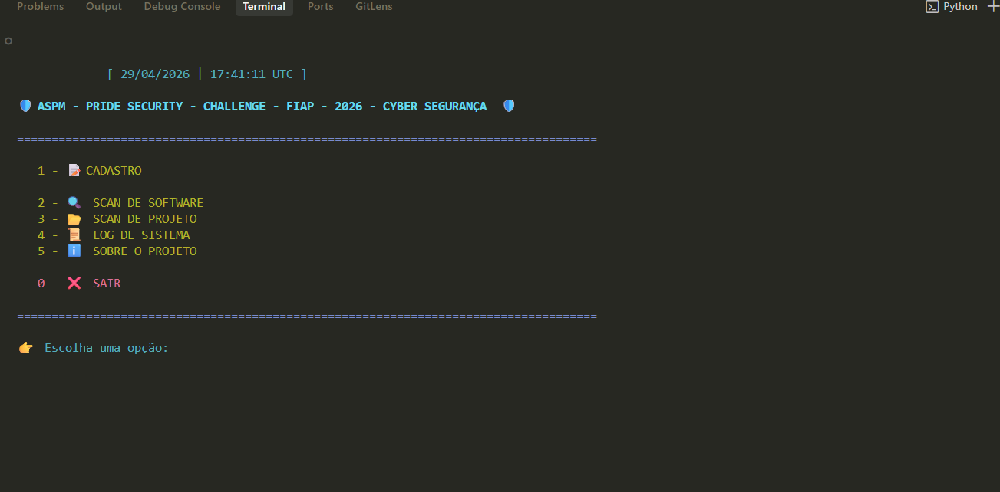
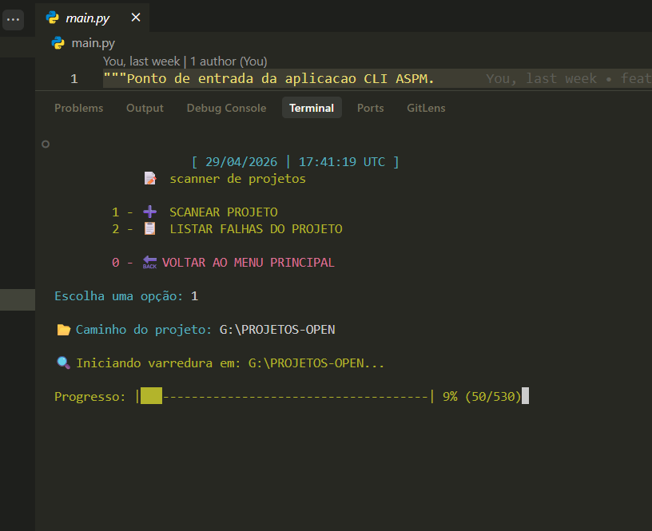
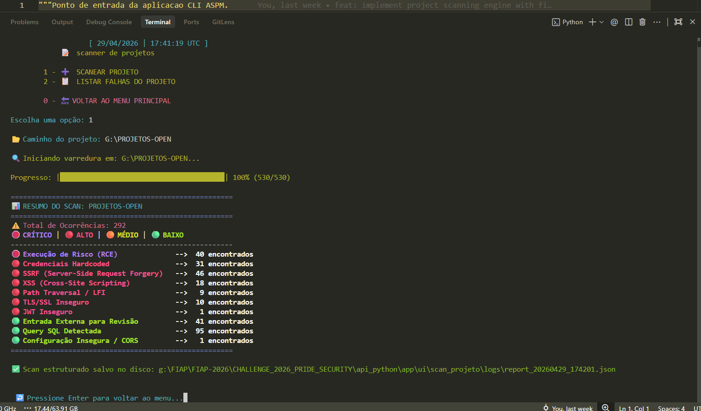
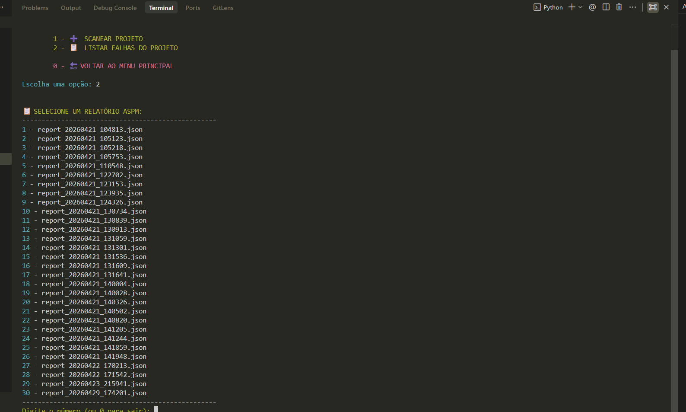
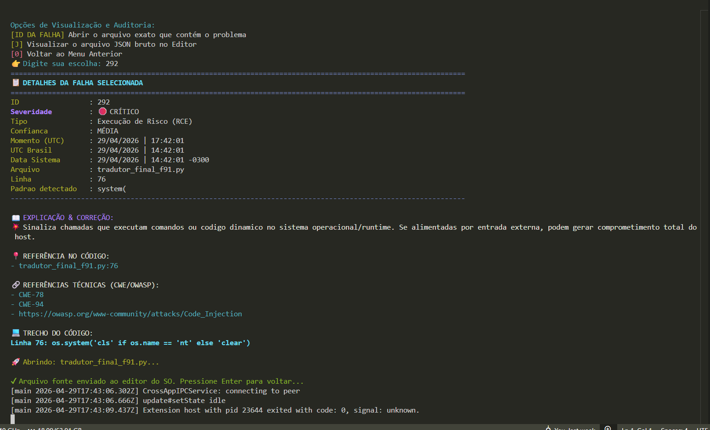
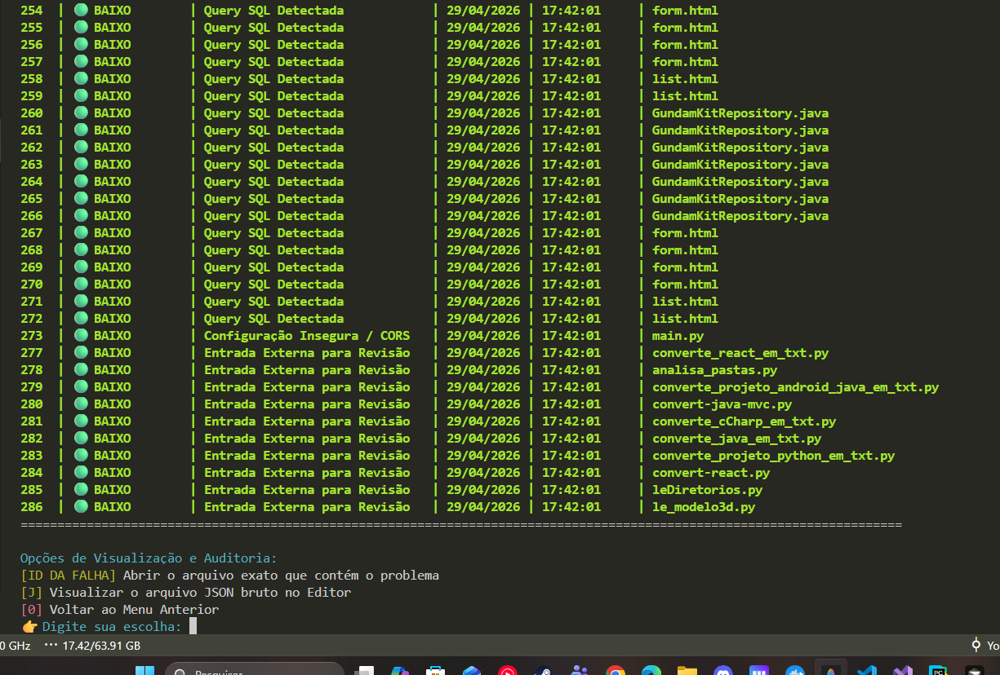

# 🛡️ ASPM IA — Security Scanner CLI

ASPM IA — Security Scanner CLI | FIAP Challenge 2026 / Pride Security | ASPM, DevSecOps, GRC e Segurança da Informação

<p align="center">
  
</p>

<p align="center">
  
  
  
</p>

<p align="center">
  <a href="./README.md">🏠 README Raiz</a> •
  <a href="./documentacao/README.md">📚 Dicionário</a> •
  <a href="#como-executar">🚀 Como Executar</a> •
  <a href="#roadmap">🗺️ Roadmap</a>
</p>

---

## 📖 Sobre o Projeto

O **ASPM IA — Security Scanner CLI** é um projeto acadêmico de portfólio inspirado no **FIAP Challenge 2026 / Pride Security**, com foco em ASPM, DevSecOps, GRC e Segurança da Informação.

A proposta é demonstrar uma ferramenta CLI em Python capaz de executar varreduras locais em projetos de software, identificar padrões de risco em código-fonte, classificar achados por severidade e gerar relatórios estruturados para apoio à análise técnica, governança, riscos e compliance.

Este repositório é uma apresentação pública e conceitual de portfólio. O repositório oficial do projeto permanece restrito aos integrantes autorizados.

---

## 🏗️ Arquitetura do Módulo (Fase Atual)

Abaixo, os diagramas em Mermaid adaptados para renderização no GitHub:




---

## 🛠️ Tecnologias e Ferramentas

| Tecnologia | Descrição | Ícone |
| :--- | :--- | :---: |
| **Python** | Linguagem base do projeto |  |
| **Docker** | Containerização e isolamento |  |
| **Colorama** | Interface CLI colorida |  |
| **Text DB** | Persistência simples via arquivo .txt |  |

---

## 📂 Estrutura de Pastas

```text
api_python/
├── app/
│   ├── ui/               # Interface de Usuário (CLI)
│   │   ├── menu.py       # Menu principal
│   │   └── cadastro/     # Sistema de CRUD de usuários
│   └── utils/            # Funções utilitárias (tempo, helpers)
├── main.py               # Ponto de entrada da aplicação
├── requirements.txt      # Dependências do projeto
├── Dockerfile            # Configuração da imagem Docker
└── docker-compose.yml    # Orquestração do container
```

---

<a id="como-executar"></a>

## 🚀 Como Executar

### 🐳 Via Docker (Recomendado)

Para rodar o ambiente completamente isolado e interativo:

```bash
docker compose up --build
```

### 🐍 Via Python Local

1. Crie um ambiente virtual:

   ```bash
   python -m venv .venv
   ```

2. Instale as dependências:

   ```bash
   pip install -r requirements.txt
   ```

3. Execute:

   ```bash
   python main.py
   ```

---

## 🖥️ Demonstração do Módulo CLI/CMD

O módulo CLI/CMD do ASPM IA permite executar varreduras locais em projetos de software, identificar padrões de risco e gerar relatórios estruturados para análise posterior.

### Funcionalidades demonstradas

- Menu interativo em terminal;
- Scan de projetos locais;
- Barra de progresso da varredura;
- Resumo consolidado de ocorrências;
- Classificação por severidade: crítico, alto, médio e baixo;
- Detecção de padrões como RCE, credenciais hardcoded, SSRF, XSS, path traversal, TLS/SSL inseguro, JWT inseguro, CORS e queries SQL;
- Geração de relatório estruturado em JSON;
- Listagem de relatórios anteriores;
- Visualização detalhada de cada achado;
- Exibição do arquivo, linha, padrão detectado e trecho de código;
- Referências técnicas CWE/OWASP;
- Abertura automática do arquivo-fonte no editor para facilitar correção.

### 📸 Demonstração do fluxo

#### 1. Menu principal


#### 2. Scan com barra de progresso


#### 3. Resumo consolidado do scan


#### 4. Listagem de relatórios JSON


#### 5. Detalhe da falha selecionada


#### 6. Abertura automática do código-fonte


---

<a id="roadmap"></a>

## 🗺️ Roadmap / Próximos Passos

- [x] Estrutura base de pastas;
- [x] Interface CLI/CMD inicial;
- [x] Scanner local de projetos;
- [x] Barra de progresso da varredura;
- [x] Classificação de achados por severidade;
- [x] Geração de relatórios estruturados em JSON;
- [x] Listagem de relatórios anteriores;
- [x] Visualização detalhada de falhas;
- [x] Exibição de arquivo, linha, padrão detectado e trecho de código;
- [x] Referências técnicas CWE/OWASP;
- [x] Abertura automática do arquivo-fonte no editor;
- [ ] Redução de falsos positivos por validação contextual;
- [ ] Exportação de relatórios em HTML/PDF;
- [ ] Dashboard web para visualização dos achados;
- [ ] Integração com pipelines CI/CD;
- [ ] Integração com bases CVE/CWE;
- [ ] Camada de IA para explicação, priorização e remediação dos riscos.

---

<p align="center">
  <b>RM 570877 - Paulo André Carminati</b><br>
  FIAP - 1TDCPV - 2026
</p>
