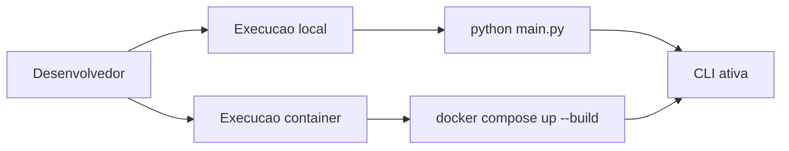

# 🐍 ASPM IA - Python API Core

<p align="center">
  
</p>

<p align="center">
  
  
  
</p>

<p align="center">
  <a href="../README.md">🏠 README Raiz</a> •
  <a href="../documentacao/README.md">📚 Dicionario</a> •
  <a href="#-como-executar">🚀 Como Executar</a> •
  <a href="#-roadmap--proximos-passos">🗺️ Roadmap</a>
</p>

---

## 📖 Sobre o Modulo

Este diretório contém o **Core da API Python** do projeto **ASPM IA FIAP - Desafio Pride 2026**. Atualmente, o projeto está em suas fases iniciais ("engatinhando"), focando na estrutura base de gerenciamento de usuários e segurança de ativos.

O objetivo futuro é integrar motores de busca de vulnerabilidades e análise de postura de segurança (ASPM) em uma interface CLI intuitiva e containerizada.

---

## 🏗️ Arquitetura do Modulo (Fase Atual)

Abaixo, os diagramas em Mermaid adaptados para renderizacao no GitHub:




---

## 🛠️ Tecnologias e Ferramentas

| Tecnologia | Descrição | Ícone |
| :--- | :--- | :---: |
| **Python** | Linguagem base do projeto |  |
| **Docker** | Containerização e isolamento |  |
| **Colorama** | Interface CLI colorida |  |
| **Text DB** | Persistência simples via arquivo .txt |  |

---

## 📂 Estrutura de Pastas

```text
api_python/
├── app/
│   ├── ui/               # Interface de Usuário (CLI)
│   │   ├── menu.py       # Menu principal
│   │   └── cadastro/     # Sistema de CRUD de usuários
│   └── utils/            # Funções utilitárias (tempo, helpers)
├── main.py               # Ponto de entrada da aplicação
├── requirements.txt      # Dependências do projeto
├── Dockerfile            # Configuração da imagem Docker
└── docker-compose.yml    # Orquestração do container
```

---

## 🚀 Como Executar

### 🐳 Via Docker (Recomendado)

Para rodar o ambiente completamente isolado e interativo:

```bash
docker compose up --build
```

### 🐍 Via Python Local

1. Crie um ambiente virtual:

   ```bash
   python -m venv .venv
   ```

2. Instale as dependências:

   ```bash
   pip install -r requirements.txt
   ```

3. Execute:

   ```bash
   python main.py
   ```

---

## 🖥️ Demonstração do Módulo CLI/CMD

O módulo CLI/CMD do ASPM IA permite executar varreduras locais em projetos de software, identificar padrões de risco e gerar relatórios estruturados para análise posterior.

### Funcionalidades demonstradas

- Menu interativo em terminal;
- Scan de projetos locais;
- Barra de progresso da varredura;
- Resumo consolidado de ocorrências;
- Classificação por severidade: crítico, alto, médio e baixo;
- Detecção de padrões como RCE, credenciais hardcoded, SSRF, XSS, path traversal, TLS/SSL inseguro, JWT inseguro, CORS e queries SQL;
- Geração de relatório estruturado em JSON;
- Listagem de relatórios anteriores;
- Visualização detalhada de cada achado;
- Exibição do arquivo, linha, padrão detectado e trecho de código;
- Referências técnicas CWE/OWASP;
- Abertura automática do arquivo-fonte no editor para facilitar correção.

---

## 📈 Roadmap / Próximos Passos

- [x] Estrutura base de pastas.
- [x] CRUD básico de usuários.
- [x] Suporte a Docker.
- [ ] Integração com Banco de Dados persistente (SQLite/MongoDB).
- [ ] Implementação de Scanners de Vulnerabilidades.
- [ ] Dashboard de logs com IA.

---

<p align="center">
  <b>RM 570877 - Paulo André Carminati</b><br>
  FIAP - 1TDCPV - 2026
</p>
