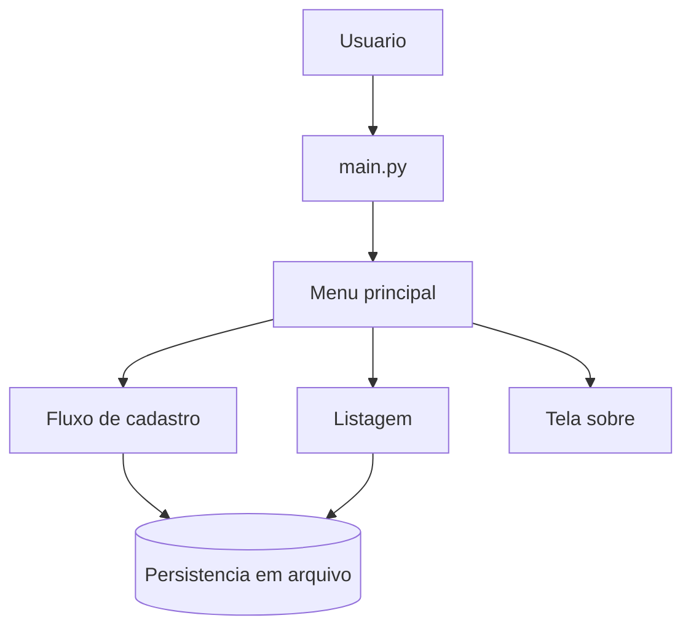
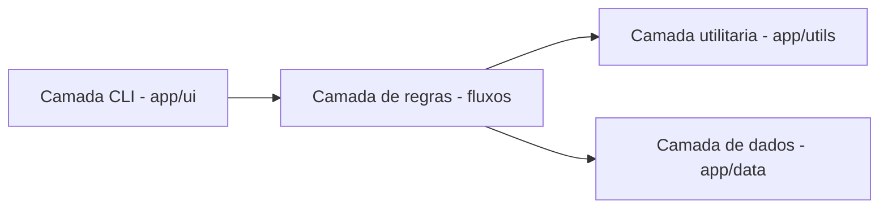
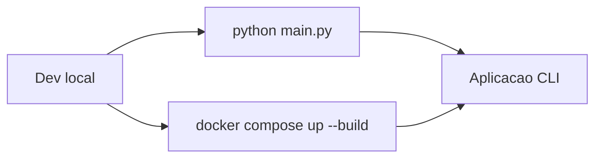

# 🏗️ 03 - Arquitetura Tecnica

  
  

**Navegacao:** [📚 Dicionario](./README.md) • [⚙️ Anterior: Instalacao](./02-instalacao-execucao.md) • [🧩 Proximo: Modulos](./04-modulos-responsabilidades.md)

## 🧭 Menu de Diagramas

- [Fluxo geral da aplicacao](#fluxo-geral-da-aplicacao)
- [Arquitetura por camadas](#arquitetura-por-camadas)
- [Execucao local e container](#execucao-local-e-container)

## 📌 Visao da arquitetura

A arquitetura atual prioriza simplicidade, separacao por responsabilidade e facilidade de manutencao.

## 🗺️ Diagramas (Mermaid GitHub)

### Fluxo geral da aplicacao

### Arquitetura por camadas

### Execucao local e container

## 🧱 Camadas principais

- `main.py`: ponto de entrada da aplicacao.
- `app/ui`: menus e interacao com usuario.
- `app/utils`: funcoes de suporte (helpers, tempo, etc.).
- `app/data`: persistencia simples baseada em arquivo.

## 🎯 Principios adotados

- Modularidade: cada pasta atende a um papel especifico.
- Legibilidade: codigo orientado a aprendizado e evolucao.
- Escalabilidade incremental: base preparada para novos modulos.

## 🚀 Evolucao esperada

- Introducao de camada de servicos.
- Persistencia em banco relacional ou NoSQL.
- Isolamento dos fluxos de scanner e auditoria.

---

**Proxima leitura recomendada:** [🧩 04 - Modulos e Responsabilidades](./04-modulos-responsabilidades.md)
